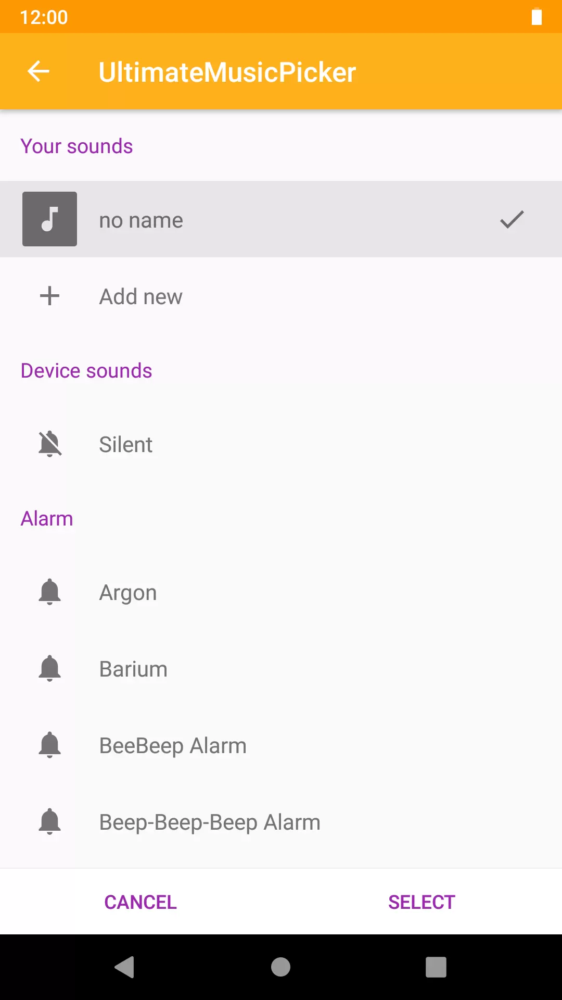
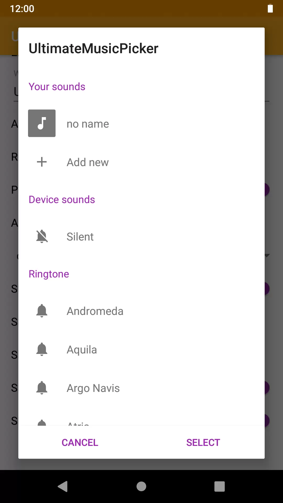
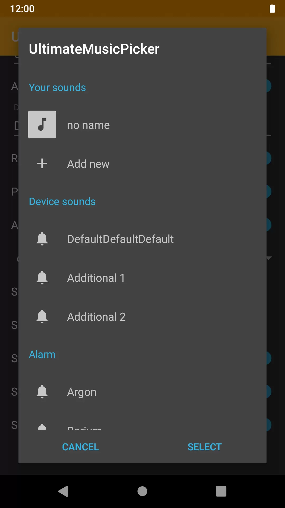

<div align="center">
  
</div>

<h1 align="center">UltimateRingtonePicker</h1>

<div align="center">
  <strong>Pick ringtone, notification, alarm sound and ringtone files from external storage with an activity or a dialog</strong>
</div>
</br>
<div align="center">
    <a href="https://android-arsenal.com/details/1/7141">
        
    </a>
    <a href="https://travis-ci.org/DeweyReed/UltimateRingtonePicker">
        
    </a>
    <a href="https://jitpack.io/#DeweyReed/UltimateRingtonePicker">
        
    </a>
    <a href="https://android-arsenal.com/api?level=14">
        
    </a>
</div>
</br>

**3.0 API has been changed completely. Currently it's in the alpha. Everything may be changed.**

**[Click here to use the deprecated 2.X](./README_OLD.md).**

## Features

- Respects Scoped Storage(MediaStore is used)
- Available as an Activity and a Dialog
- Provides options to pick alarm sound, notification sound, ringtone sound and external ringtones.
- Ringtone preview
- Provides interface to set a default entry
- Provides interface to add custom ringtone entries
- Sorts external ringtones with artists, albums and folders
- Automatically remembers which external ringtones users picked
- Multi Select
- Dark theme support out of box
- Permission are handled internally
- Storage Access Framework support

This library targets Android 29 and uses `appcompat 1.1.0`.

## Screenshot

||||
|:-:|:-:|:-:|
||||

## Gradle Dependency

Step 1. Add the JitPack repository to your build file

Add it in your root build.gradle at the end of repositories:

```Groovy
allprojects {
    repositories {
        ...
        maven { url 'https://jitpack.io' }
    }
}
```

Step 2. Add the dependency

[](https://jitpack.io/#DeweyReed/UltimateRingtonePicker)

```Groovy
dependencies {
    implementation "com.github.DeweyReed:UltimateRingtonePicker:${version}"
}
```

## Usage

Here're some examples:

### System ringtones dialog(no permission required)

```Kotlin
RingtonePickerDialog.createInstance(
    UltimateRingtonePicker.Settings(
        showCustomRingtone = false,
        systemRingtoneTypes = UltimateRingtonePicker.Settings.allSystemRingtoneTypes
    ),
    "Dialog Picker"
).show(supportFragmentManager, null)
```

To receive the pick result, implement `RingtonePickerListener` in your activity or fragment.

### System and device ringtones activity(Permission is handled internally)

Add `RingtonePickerActivity` to your `AndroidManifest.xml`:

```XML
<activity
    android:name="xyz.aprildown.ultimateringtonepicker.RingtonePickerActivity" />
```

```Kotlin
startActivityForResult(
    RingtonePickerActivity.putInfoToLaunchIntent(
        Intent(this, RingtonePickerActivity::class.java),
            UltimateRingtonePicker.Settings(
            showDefault = true,
            defaultUri = UltimateRingtonePicker.Settings.createRawUri(this, R.raw.default_ringtone),
            defaultTitle = "Default Ringtone",
            additionalRingtones = listOf(
                RingtonePickerEntry(
                    UltimateRingtonePicker.Settings.createAssetUri("asset1.wav"),
                    "Assets/asset1.mp3"
                )
            ),
            systemRingtoneTypes = UltimateRingtonePicker.Settings.allSystemRingtoneTypes,
            deviceRingtoneTypes = UltimateRingtonePicker.Settings.allDeviceRingtoneTypes
        ),
        "Activity Picker"
    ),
    // Request Code
    200
)
```

Receive the pick result in your `onActivityResult`:

```Kotlin
override fun onActivityResult(requestCode: Int, resultCode: Int, data: Intent?) {
    // You must check requestCode here because RingtonePickerFragment may
    // startActivityForResult internally and require super.onActivityResult here to be called.
    if (requestCode == 200 && resultCode == Activity.RESULT_OK && data != null) {
        val ringtones: List<RingtonePickerEntry> = RingtonePickerActivity.getPickerResult(data)

    } else {
        super.onActivityResult(requestCode, resultCode, data)
    }
}
```

### More examples

You can find many examples in [MainActivity](./app/src/main/java/xyz/aprildown/ultimateringtonepicker/app/MainActivity.kt). Also make sure check [UltimateRingtonePicker](./library/src/main/java/xyz/aprildown/ultimateringtonepicker/UltimateRingtonePicker.kt) to see all parameters.

## BTW

`UltimateRingtonePicker` supports activity pick `RingtonePickerActivity` and dialog pick `RingtonePickerDialog` out of box. Both of them are just wrappers of `RingtonePickerFragment`. Therefore, you can directly wrap `RingtonePickerFragment` into your activity/fragment to provide more customization!

## License

[MIT License](./LICENSE)
